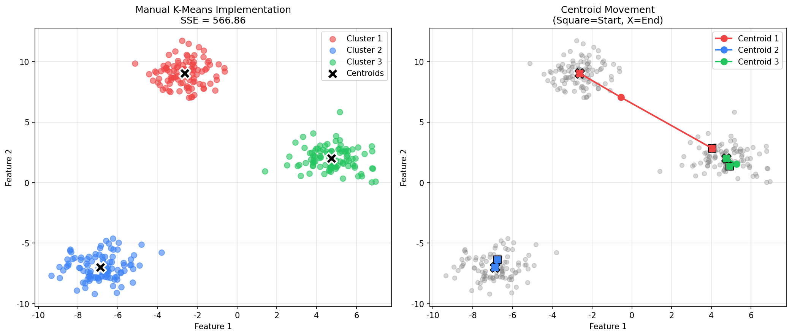
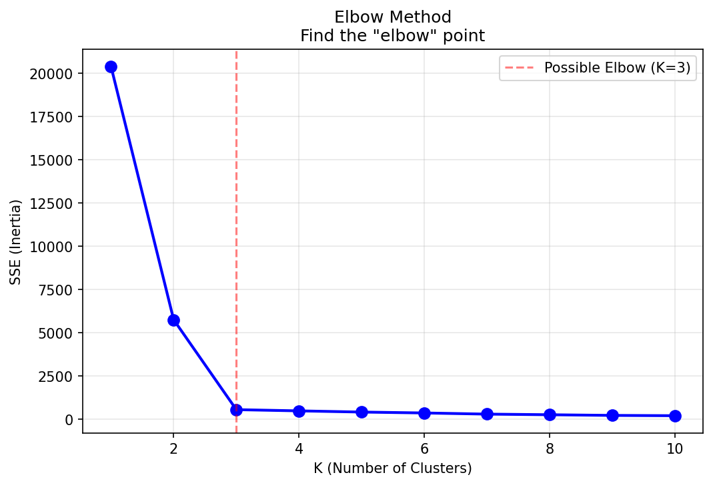
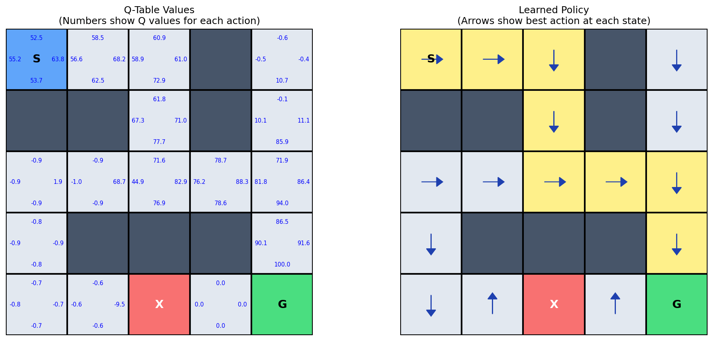
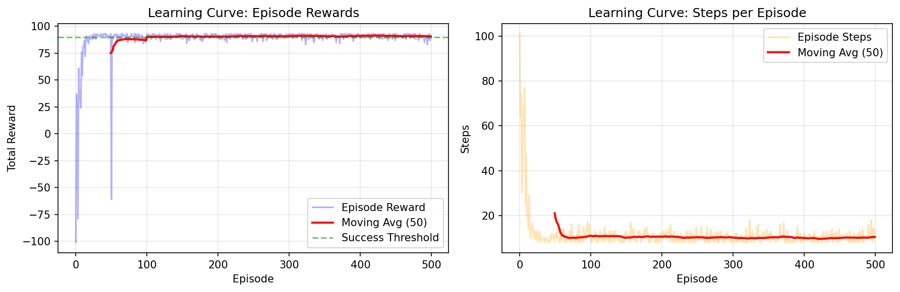

# 算法学习仓库

本仓库包含机器学习与强化学习经典算法的 Python 实现示例，适合初学者理解算法原理。

## 目录结构

```
algorithm/
└── sklearn/
    ├── scikit.py          # KNN 分类 + PCA 降维示例
    ├── kmeans.py          # K-Means 聚类（手写实现 + sklearn 对比）
    ├── qlearning.py       # Q-Learning 强化学习（迷宫寻路）
    ├── kmeans_result.png  # K-Means 聚类可视化结果
    ├── elbow_method.png   # 肘部法则图（辅助选择 K 值）
    ├── qlearning_policy.png  # Q-Learning 策略可视化
    └── qlearning_curve.png   # Q-Learning 学习曲线
```

## 算法介绍

### 1. KNN 分类 + PCA 降维 (`scikit.py`)

使用 scikit-learn 演示 K 近邻分类器（KNN）与主成分分析（PCA）降维的基本用法。

**核心流程：**
- 用 `make_blobs` 生成 300 个三维随机样本，分为 3 个类别
- 用 `KNeighborsClassifier(n_neighbors=3)` 训练 KNN 模型并预测新样本
- 用 PCA 将三维数据降至二维，再用散点图可视化

**涉及概念：** KNN、PCA、降维、可视化

---

### 2. K-Means 聚类 (`kmeans.py`)

包含 K-Means 算法的**手写实现**与 **sklearn 版本对比**，并提供可视化和肘部法则。

**手写实现核心步骤：**

```
1. 初始化：从数据中随机选 K 个点作为初始质心
2. 分配：将每个数据点分配给距离最近的质心（欧几里得距离）
3. 更新：将每个簇的质心更新为簇内所有点的均值
4. 重复步骤 2-3，直到质心不再移动（收敛）
```

**主要特性：**
- `KMeans` 类：手写实现，支持记录每次迭代的质心轨迹
- `compare_with_sklearn()`：对比手写实现与 sklearn 的 SSE（簇内平方和）
- `elbow_method()`：肘部法则，帮助选择最优 K 值
- 可视化聚类结果与质心移动轨迹

**运行输出：**

| 文件 | 内容 |
|------|------|
| `kmeans_result.png` | 聚类结果 + 质心移动轨迹 |
| `elbow_method.png` | 不同 K 值对应的 SSE 曲线 |

---

### 3. Q-Learning 强化学习 (`qlearning.py`)

经典的迷宫寻路问题，演示 Q-Learning 算法从零开始学习最优策略的过程。

**迷宫设定（5×5）：**

```
S . . # .
# # . # .
. . . . .
. # # # .
. . X . G
```

| 符号 | 含义 | 奖励 |
|------|------|------|
| S | 起点 | — |
| G | 终点 | +100 |
| X | 陷阱 | -50 |
| `#` | 墙（不可通行） | — |
| `.` | 空地 | -1（每步） |

**Q-Learning 更新公式：**

```
Q(s, a) ← Q(s, a) + α × [r + γ × max Q(s', a') - Q(s, a)]
```

| 参数 | 含义 |
|------|------|
| α（学习率） | 新信息的权重，默认 0.1 |
| γ（折扣因子） | 未来奖励的重要性，默认 0.95 |
| ε（探索率） | 随机探索的概率，默认 0.2 |

**ε-贪婪策略：**
- 以概率 ε 随机探索（防止陷入局部最优）
- 以概率 1-ε 选择当前最优动作（利用已学知识）

**运行输出：**

| 文件 | 内容 |
|------|------|
| `qlearning_policy.png` | Q 表热力图 + 最优策略箭头图 |
| `qlearning_curve.png` | 每回合奖励与步数的学习曲线 |

---

## 环境依赖

```bash
pip install numpy matplotlib scikit-learn
```

## 运行方式

```bash
# KNN + PCA 示例
python sklearn/scikit.py

# K-Means 聚类
python sklearn/kmeans.py

# Q-Learning 强化学习
python sklearn/qlearning.py
```

## 可视化示例

### K-Means 聚类结果


### 肘部法则


### Q-Learning 学习策略


### Q-Learning 学习曲线

